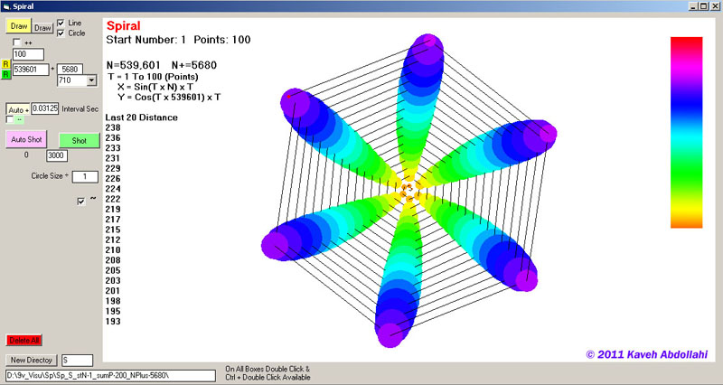



## Spiral Builder

### Description

Numeric Spiral

Spiral on different sides

each numbers build another spiral

is good for make video
 
### More Info
 

             |
---                |---
**Submitted On**   |2010-05-09 06:53:52
**By**             |[Kaveh Abdollahi](https://github.com/Planet-Source-Code/PSCIndex/blob/master/ByAuthor/kaveh-abdollahi.md)
**Level**          |Intermediate
**User Rating**    |5.0 (10 globes from 2 users)
**Compatibility**  |VB 6\.0
**Category**       |[Graphics](https://github.com/Planet-Source-Code/PSCIndex/blob/master/ByCategory/graphics__1-46.md)
**World**          |[Visual Basic](https://github.com/Planet-Source-Code/PSCIndex/blob/master/ByWorld/visual-basic.md)
**Archive File**   |[Spiral\_Bui2210288282011\.zip](https://github.com/Planet-Source-Code/kaveh-abdollahi-spiral-builder__1-74063/archive/master.zip)

